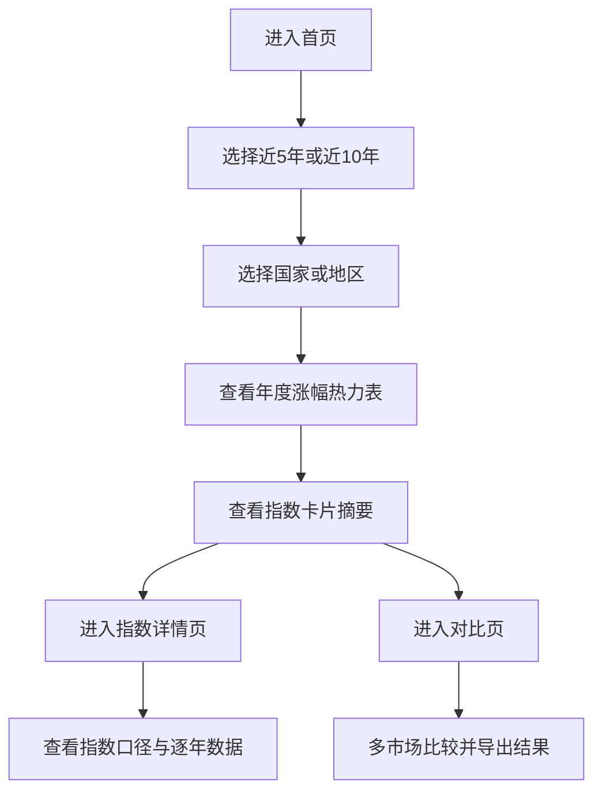

## 1. 产品概述
这是一个面向投资研究与市场比较的国家指数年度涨幅看板，用来查看各国家或地区宽基指数在近 5 年、近 10 年内每一年的涨跌幅，并进行横向比较。

- 解决“跨国家宽基指数口径不统一、历史年度涨幅难以一屏比较”的问题，目标用户为关注全球市场配置的个人投资者与研究型用户。
- 产品价值在于把美国、A 股、香港、台湾、澳大利亚、墨西哥、越南等市场的宽基指数统一为可比较的年度收益面板，并保留指数口径说明。

## 2. 核心功能

### 2.1 功能模块
1. **首页**：产品说明、国家指数卡片、近 5 年/近 10 年切换、年度涨幅热力表。
2. **指数详情页**：单个国家或地区的指数简介、口径说明、年度涨幅明细、累计涨幅与年化涨幅。
3. **对比页**：多国家宽基指数并排比较，支持按年度涨幅、累计涨幅、波动区间排序。

### 2.2 页面详情
| 页面名称 | 模块名称 | 功能描述 |
|-----------|-------------|---------------------|
| 首页 | 顶部概览区 | 展示产品定位、统计范围、最新更新时间、数据口径说明入口 |
| 首页 | 周期切换器 | 支持近 5 年、近 10 年切换 |
| 首页 | 国家筛选区 | 支持选择美国、中国 A 股、香港、台湾、澳大利亚、墨西哥、越南等市场 |
| 首页 | 年度涨幅热力表 | 以年份为列、国家为行展示年度涨跌幅，颜色映射涨跌强弱 |
| 首页 | 指数卡片区 | 展示当前市场所选宽基指数名称、代码、最新年度表现、5 年累计、10 年累计 |
| 指数详情页 | 指数基础信息 | 展示国家、指数名称、代码、是否官方指数或代理指数、指数说明 |
| 指数详情页 | 年度收益表 | 展示每一年的年初、年末、年度涨跌幅 |
| 指数详情页 | 区间表现区 | 展示近 3 年、5 年、10 年累计涨幅与 CAGR |
| 指数详情页 | 数据口径说明 | 解释该市场为何选该指数，以及是否使用 ETF 代理 |
| 对比页 | 多市场选择器 | 支持多选国家或地区 |
| 对比页 | 横向对比矩阵 | 对比年度涨幅、累计涨幅、最大回撤近似值、胜率 |
| 对比页 | 排序与导出 | 支持按最近一年、近 5 年累计、近 10 年 CAGR 排序，并导出 CSV |

## 3. 核心流程
用户进入首页后，先选择统计周期，再选择关注的国家或地区，随后查看年度涨幅热力表与国家卡片；如需深入研究，可进入指数详情页查看口径说明与逐年明细；如需横向比较多个市场，则进入对比页进行多市场分析和导出。

## 4. 用户界面设计

### 4.1 设计风格
- 主色：深墨蓝、交易屏绿、暖橙红，用于表现市场冷暖与金融终端感。
- 按钮风格：圆角较小、偏终端面板风格，强调明确的状态切换。
- 字体：中文使用思源黑体或苹方，数字使用等宽数字风格，强化年度收益对齐感。
- 布局风格：桌面优先，顶部概览 + 中部热力表 + 下方卡片与说明区域。
- 图标风格：简洁线性图标，避免花哨金融素材。

### 4.2 页面设计概览
| 页面名称 | 模块名称 | UI 元素 |
|-----------|-------------|-------------|
| 首页 | 顶部概览区 | 大号标题、数据说明按钮、更新时间标签、周期切换按钮组 |
| 首页 | 年度涨幅热力表 | 固定表头、滚动列、红绿或青橙配色、单元格悬浮提示 |
| 首页 | 指数卡片区 | 深色卡片、指数代码标签、累计涨幅徽标、进入详情按钮 |
| 指数详情页 | 年度收益表 | 高可读表格、趋势标记、说明折叠区 |
| 指数详情页 | 区间表现区 | 指标卡片、累计收益与 CAGR 并列展示 |
| 对比页 | 横向对比矩阵 | 多列比较表、排序控件、导出按钮 |

### 4.3 响应式
- 采用桌面优先设计。
- 平板端保留完整表格能力，使用横向滚动。
- 手机端将年度热力表转换为卡片式年度列表，优先展示最近 5 年。

## 5. 指数覆盖与口径策略

### 5.1 首批覆盖市场
| 国家或地区 | 首选宽基指数 | 代码示例 | 口径说明 |
|-----------|-------------|---------|---------|
| 美国 | Wilshire 5000 Total Market Index / 代理为 VTI | `^W5000` / `VTI` | 优先全市场指数；若免费接口不可用，可暂用全市场 ETF 代理 |
| 中国 A 股 | 中证全指 | `000985.SH` | 覆盖沪深 A 股的宽基代表，优先于单一大盘指数 |
| 香港 | 恒生综合指数 | `HSCI.HK` | 较恒生指数更宽，适合作为港股宽基口径 |
| 台湾 | 台湾加权指数 | `^TWII` | 台湾市场常用宽基口径 |
| 澳大利亚 | All Ordinaries / S&P/ASX 200 | `^AORD` / `^AXJO` | 优先更宽口径，若接口受限可退化到 ASX 200 |
| 墨西哥 | S&P/BMV IPC | `^MXX` | 墨西哥市场主流宽基代表 |
| 越南 | VN-Index / VN Allshare | `^VNINDEX` | 优先更宽口径，按可获取性决定 |

### 5.2 年度涨幅计算规则
- 年度涨幅 = `(当年最后一个交易日收盘价 / 上一年最后一个交易日收盘价 - 1) * 100%`
- 若当年尚未结束，则当前年份标记为“年内至今”，不与完整年度混淆。
- 近 5 年与近 10 年均按完整自然年展示；若数据不足，页面标注“样本不足”。
- 同时输出：
  - 每年涨跌幅
  - 区间累计涨幅
  - CAGR 年化涨幅

### 5.3 数据可信度分层
1. 优先使用官方指数历史行情。
2. 若免费接口无法稳定提供官方指数历史数据，则使用最接近的宽基 ETF 代理，并在页面明显标注“代理口径”。
3. 同一市场不得在未提示的情况下混用两套口径。
