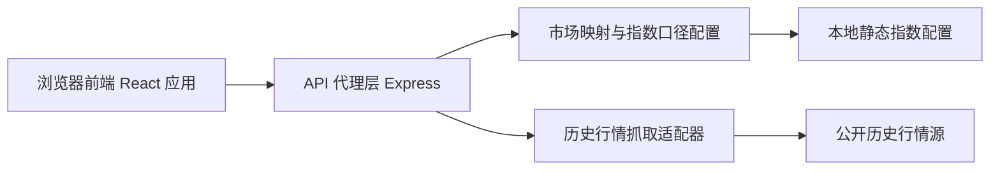
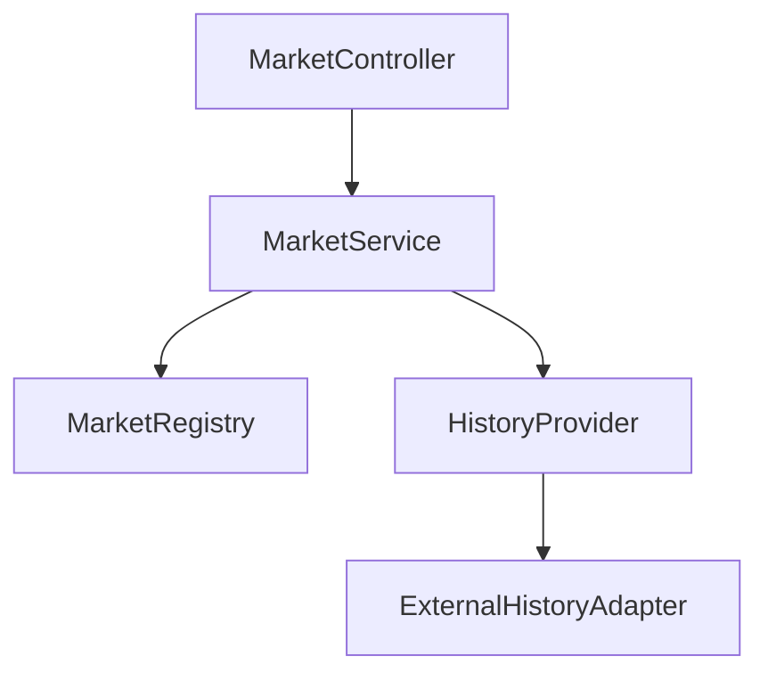
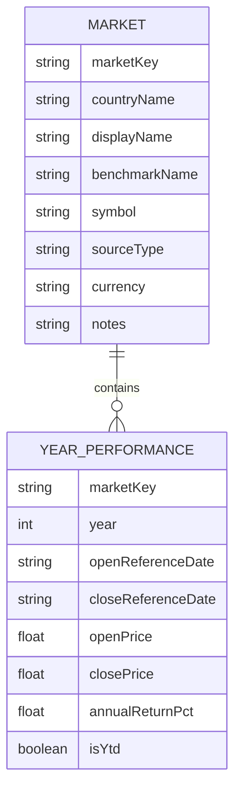

## 1. 架构设计

本项目采用前端单页应用 + 轻量后端代理的结构。前端负责筛选、展示、对比与导出，后端负责统一抓取历史行情、标准化不同市场代码，并输出可直接用于年度涨幅计算的数据结构。



## 2. 技术说明

* 前端：React 18 + TypeScript + Vite

* 样式：Tailwind CSS 3

* 图表与表格：原生表格 + 轻量图形组件

* 后端：Node.js + Express

* 数据格式：JSON

* 初始化方式：Vite

## 3. 路由定义

| 路由                   | 用途                          |
| -------------------- | --------------------------- |
| `/`                  | 首页，查看近 5 年/近 10 年国家指数年度涨幅总览 |
| `/market/:marketKey` | 指数详情页，查看单个国家或地区的完整年度表现与口径说明 |
| `/compare`           | 多市场对比页，支持横向比较与导出            |

## 4. API 定义

### 4.1 获取市场列表

`GET /api/markets`

```ts
type MarketSummary = {
  marketKey: string;
  countryName: string;
  displayName: string;
  benchmarkName: string;
  symbol: string;
  sourceType: "official" | "proxy";
  currency: string;
  notes?: string;
};

type MarketsResponse = {
  updatedAt: string;
  items: MarketSummary[];
};
```

### 4.2 获取单个市场年度涨幅

`GET /api/market/:marketKey/performance?years=5|10`

```ts
type YearPerformance = {
  year: number;
  openReferenceDate: string;
  closeReferenceDate: string;
  openPrice: number;
  closePrice: number;
  annualReturnPct: number;
  isYtd?: boolean;
};

type MarketPerformanceResponse = {
  marketKey: string;
  benchmarkName: string;
  symbol: string;
  sourceType: "official" | "proxy";
  years: 5 | 10;
  cumulativeReturnPct: number;
  cagrPct: number;
  yearly: YearPerformance[];
  updatedAt: string;
};
```

### 4.3 获取多市场对比结果

`GET /api/compare?markets=us,cn_a,hk,tw&years=10`

```ts
type CompareItem = {
  marketKey: string;
  displayName: string;
  benchmarkName: string;
  latestYearReturnPct: number | null;
  cumulativeReturnPct: number;
  cagrPct: number;
  yearly: Array<{
    year: number;
    annualReturnPct: number;
  }>;
};

type CompareResponse = {
  years: 5 | 10;
  items: CompareItem[];
  updatedAt: string;
};
```

## 5. 服务端架构图



## 6. 数据模型

### 6.1 数据模型定义



### 6.2 本地配置定义

由于首版以公开历史行情为主，首期不引入数据库，使用本地配置文件维护市场与指数映射。

```ts
type MarketConfig = {
  marketKey: string;
  countryName: string;
  displayName: string;
  benchmarkName: string;
  symbol: string;
  sourceType: "official" | "proxy";
  preferredSource: "stooq" | "yahoo" | "eastmoney" | "manual";
  fallbackSymbols?: string[];
  currency: string;
  notes?: string;
};
```

## 7. 计算逻辑

1. 拉取目标指数近 11 个自然年的日线或周线历史数据。
2. 对每个自然年选取该年最后一个有效交易日作为年末收盘基准。
3. 将上一年年末与当年年末配对，计算年度涨幅。
4. 对近 5 年、近 10 年分别计算累计涨幅与 CAGR。
5. 若某市场历史数据缺失，则返回可用年限并标记缺口。

## 8. 异常与兼容策略

* 外部历史行情源失败时，使用该市场的备用代码或备用数据源重试。

* 若主指数无公开可用历史接口，则回退到文档中预设的代理宽基 ETF。

* 对货币差异不做换汇，首版统一比较本币计价指数涨幅，避免额外汇率噪声。

* 对当前未结束年份，单独标记为 YTD，避免与完整年度混淆。

## 9. 首版实施边界

* 首版只做国家或地区宽基指数，不做单只股票。

* 首版只做历史年度涨幅，不做盘中实时估值。

* 首版优先覆盖：美国、中国 A 股、香港、台湾、澳大利亚、墨西哥、越南。

* 页面支持 CSV 导出，便于后续继续分析。

